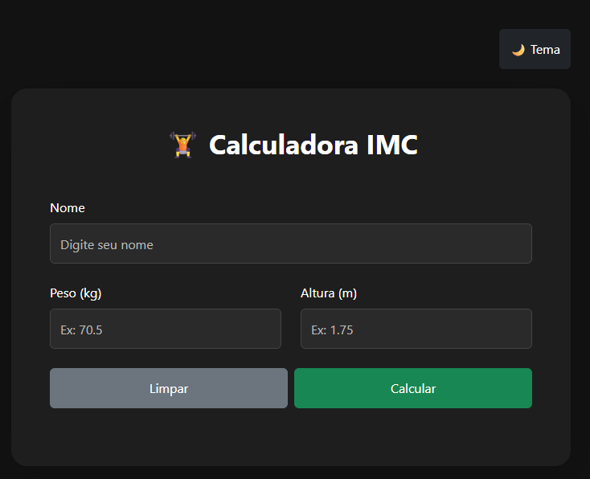

# 🧮 Calculadora IMC

Sistema web desenvolvido para calcular o Índice de Massa Corporal (IMC) de forma simples e intuitiva. A aplicação permite que o usuário informe seu peso e altura, realizando o cálculo automaticamente e exibindo a classificação correspondente de acordo com os padrões da Organização Mundial da Saúde (OMS).

## 📋 Funcionalidades

* Cálculo automático do IMC
* Validação dos campos de entrada
* Exibição do resultado de forma clara
* Classificação do IMC conforme a faixa correspondente
* Interface simples e responsiva
* Fácil utilização em dispositivos móveis e desktops

## 🛠️ Tecnologias Utilizadas

### Front-end

* HTML5
* CSS3
* JavaScript

### Controle de Versão

* Git
* GitHub

## 🚀 Como Executar o Projeto

1. Clone este repositório:

```bash
git clone https://github.com/LuizHSDias/calculadora-imc.git
```

2. Acesse a pasta do projeto:

```bash
cd calculadora-imc
```

3. Abra o arquivo `Index.html` em seu navegador.

## 📖 Fórmula Utilizada

IMC = Peso (kg) / Altura² (m)

## 📊 Classificação do IMC

| IMC            | Classificação      |
| -------------- | ------------------ |
| Menor que 18,5 | Abaixo do peso     |
| 18,5 a 24,9    | Peso normal        |
| 25,0 a 29,9    | Sobrepeso          |
| 30,0 a 34,9    | Obesidade Grau I   |
| 35,0 a 39,9    | Obesidade Grau II  |
| Acima de 40    | Obesidade Grau III |

## 📷 Demonstração




## 🎯 Objetivo do Projeto

Este projeto foi desenvolvido com o objetivo de praticar conceitos de desenvolvimento web, incluindo manipulação do DOM com JavaScript, estilização com CSS e estruturação de páginas utilizando HTML.